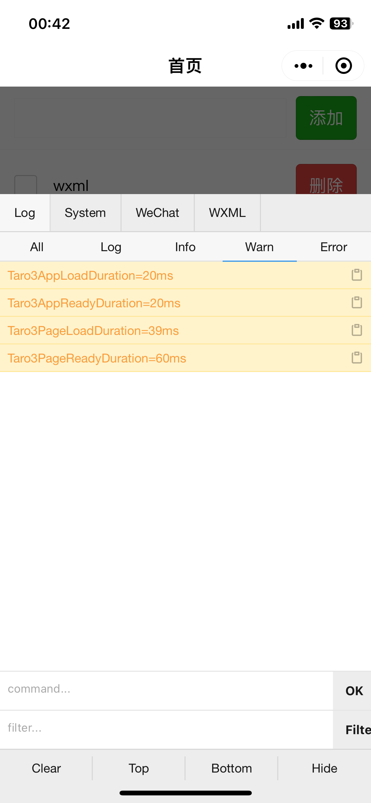

# mp-native-vs-taro-benchmark
小程序原生性能对比Taro

# 对比数据
> 多次运行可能数据会有浮动，但原生在`AppOnLaunch耗时`这一项指标上始终超越Taro3。

> 测试机型：iPhone12 Pro

| 目标 | AppOnLaunch耗时 | AppOnShow耗时 | PageOnLoad耗时 | PageOnReady耗时 |
| -- | -- | -- | -- | -- |
| 原生 | 1ms | 2ms | 34ms | 60ms |
| Taro3 | 20ms | 20ms | 39ms | 60ms |

# 原生初始化性能

# Taro3初始化性能

